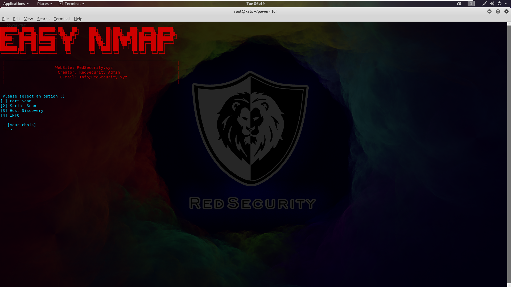

 # easy-nmap
This tool makes using nmap easier in gui based command line 
## ScreenShot

## installation
Just run the following commands to install
```
git clone https://github.com/vamsicodes7/WoU-SoT.git
cd easy-nmap
bash installer.sh
cd -
```
## Usage
Just run the following command
```
easy-nmap
```
You can run the above command anywhere in terminal
## Contact us @woxsen university
Team:
Vamsi,
Vaishnavi G (vaishnavi0307),
Mohitha,
Hemanth
